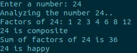

## numFacts

### Summary

numFacts is a simple program that will request you to input an integer (N). After you input, the program will print facts about N to the screen for you.

### Features
- Factors of N
- If N is prime or composite
- Sum of factors of N
- If N is a sad, happy, or perfect integer

### Install
1. Make file on local machine to clone repository into
2. Run `git clone https://github.com/sudoLuko/school/numFacts.git`
3. Change into project file `cd numFacts`, compile main.c `gcc -o main main.c`, run exectuable `./main`

### Output

