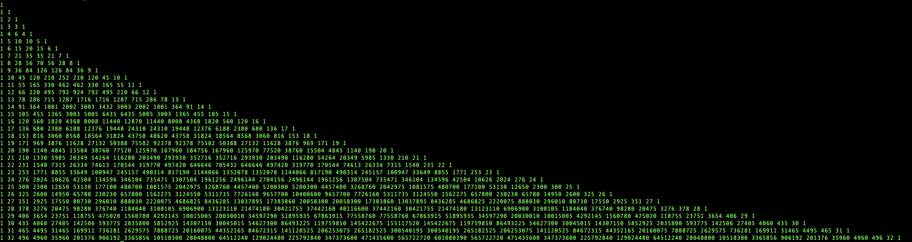

## Overview

This program will calculate and return the first 32 rows of Pascal's triangle, left-justified. Code does not use the recursive method to calculate triangle.

### Install
1. Make file on local machine to clone repository into
2. Run `git clone https://github.com/sudoLuko/school.git`
3. Change into project directory `cd school` -> `cd pascal`, compile triangle.c `gcc -o main triangle.c`, run executable `./main`

### Ouput

