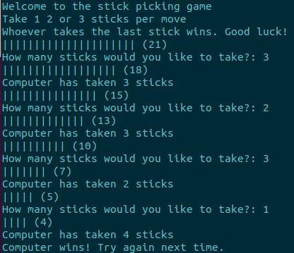

## Stick

### Summary

Stick is a simple game that you play against the computer. Given an initial (default is 21) number of sticks in a pile, players will take turns removing either 1, 2, or 3 sticks from the pile. Whoever removes the last stick wins the game.

I made two implementations of this. One in C and another in Bash.

### Features

- Default number of sticks is 21. A user can specify a different number of sticks with a command line argument (./stick 30)
- Two 'illegal entries' in a row will quit the game
- Hard to win (yay!)

### Install
1. Make file on local machine to clone repository into
2. Run `git clone https://github.com/sudoLuko/school/stickGame.git`
3. **C:**
	Change into project file `cd stickGame`, compile code for c program `gcc -o main main.c` and run `./main`
4. **Bash:**
	Change into project file `cd stickGame`, run executable `./stick`

### Output

